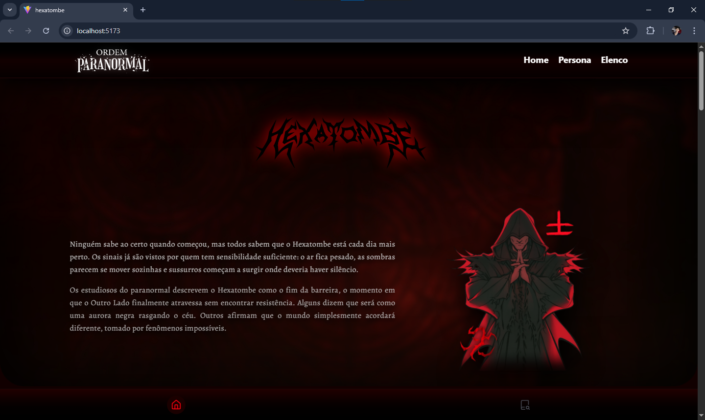

## 🩸 Sobre o Projeto

**Hexatombe** é um projeto visual e narrativo focado em horror sobrenatural, mistério e tensão psicológica.  
O site apresenta personagens, entidades, rituais e eventos ligados ao colapso da barreira entre o mundo real e o Outro Lado.



Cada seção foi pensada para criar **imersão**, utilizando:
- Paleta escura (preto e vermelho)
- Animações suaves e atmosféricas
- Cards de personagens em estilo **AAA game**
- Narrativa fragmentada e simbólica

---

## 🧩 Funcionalidades

- 🔮 **Lista de Personagens**
  - Cards estilizados
  - Múltiplas formas por personagem
  - Transições suaves e efeitos visuais

- 📖 **Página de Informações**
  - História detalhada
  - Classe, status, equipe e intérprete
  - Layout cinematográfico

- 🎭 **Elenco**
  - Associação visual entre ator e personagem
  - Grid responsivo

- 🌫️ **Animações**
  - FadeIn com IntersectionObserver
  - Movimentos sutis e não intrusivos

---

## 🛠️ Tecnologias Utilizadas

- **React**
- **React Router**
- **Tailwind CSS**
- **Lucide Icons**
- **IntersectionObserver API**
- **Vite**

---

## 🎨 Direção de Arte

- Horror sobrenatural
- Influência de jogos AAA
- Estética ritualística
- Uso simbólico de vermelho, sombras e ruído visual
- Interface limpa, mas opressiva

---

## 🚀 Como Rodar o Projeto

```bash
# instalar dependências
npm install

# rodar em ambiente de desenvolvimento
npm run dev
