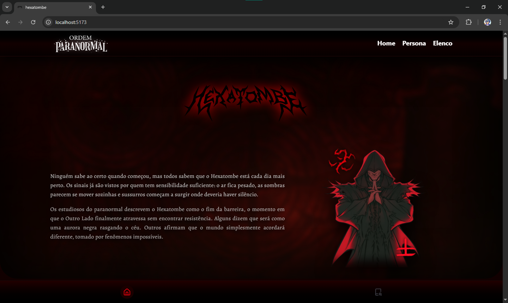
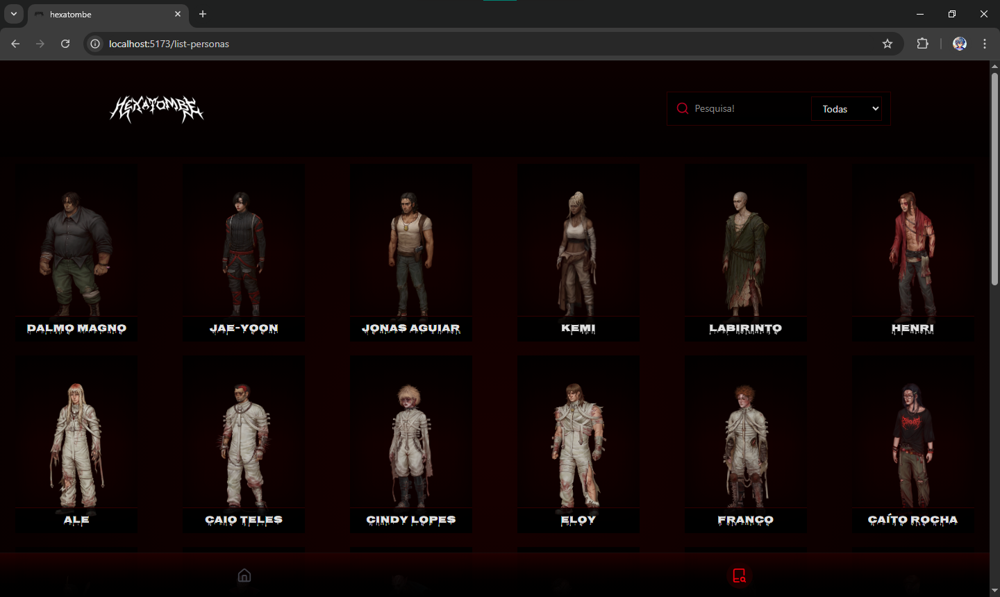

# 🩸 Hexatombe

> Projeto visual e narrativo focado em horror sobrenatural, mistério e tensão psicológica, apresentando o colapso entre o mundo real e o Outro Lado.

---

## 🌓 Visualização

|             Página Inicial             |     Página de Personagens     |
| :------------------------------------: | :---------------------------: |
|  |  |

---

## 🚀 Objetivo

O objetivo do Hexatombe é criar uma experiência digital totalmente imersiva, utilizando o desenvolvimento web para transmitir uma atmosfera cinematográfica de horror. O projeto foi construído para praticar o desenvolvimento de interfaces altamente estilizadas, manipulação de rotas dinâmicas e animações performáticas que respondem à navegação do usuário.

---

## 🛠️ Tecnologias e Conceitos

O projeto foi construído utilizando práticas modernas de desenvolvimento front-end aplicadas ao design imersivo:

- **React**: Biblioteca principal para componentização e gerenciamento de estado da aplicação.
- **React Router Dom**: Gerenciamento de rotas para navegação fluida entre a página inicial e os detalhes dos personagens.
- **Tailwind CSS**: Estilização baseada em utilitários para criar uma interface opressiva, escura e responsiva com rapidez.
- **Lucide Icons**: Pacote de ícones limpos e minimalistas que integram a interface de forma sutil.
- **IntersectionObserver API**: Utilizada para otimizar o carregamento e disparar as animações de _FadeIn_ apenas quando os elementos entram na tela.

---

## 🏗️ Funcionalidades Principais

- 🔮 **Lista de Personagens**: Cards estilizados com múltiplas formas por personagem, transições suaves e efeitos visuais inspirados em menus de jogos AAA.
- 📖 **Página de Informações**: Exibição detalhada de história, classe, status, equipe e intérprete através de um layout cinematográfico.
- 🎭 **Elenco**: Associação visual entre o ator/intérprete e o personagem organizada em um grid responsivo.
- 🌫️ **Animações Atmosféricas**: Movimentos sutis e não intrusivos que reforçam a estética ritualística e o mistério do projeto.

---

## 🎨 Direção de Arte

A identidade visual do projeto se afasta do padrão convencional de sites corporativos para abraçar uma estética de entretenimento:

- Uso simbólico de tons de vermelho, sombras profundas e ruído visual.
- Interface limpa, porém opressiva, focando na tensão psicológica através do design.

---

## 🔄 Como Rodar o Projeto

Para executar este projeto localmente, siga os passos abaixo:

1. **Clone o repositório:**

   ```bash
   git clone https://github.com/Herdes-s/hexatombe
   ```

2. **Acesse a pasta do projeto:**

   ```bash
   cd hexatombe
   ```

3. **Instale as dependências:**

   ```bash
   npm install
   ```

4. **Inicie o servidor de desenvolvimento:**
   ```bash
   npm run dev
   ```

---

## 🧠 Desafios e Aprendizados

- **Desafio:** Como coordenar as animações de FadeIn sem prejudicar a performance da página
- **Solução:** Resolvi isso utilizando a IntersectionObserver API para controlar o ciclo de vida das animações de forma nativa e leve.

---

## 🔗 Link de Acesso

Confira o projeto online: [**Visualizar Hexatombe**]("https://hexatombe-omega.vercel.app/")

---

## 👤 Autor

Desenvolvido por **Ernand Soares**.
