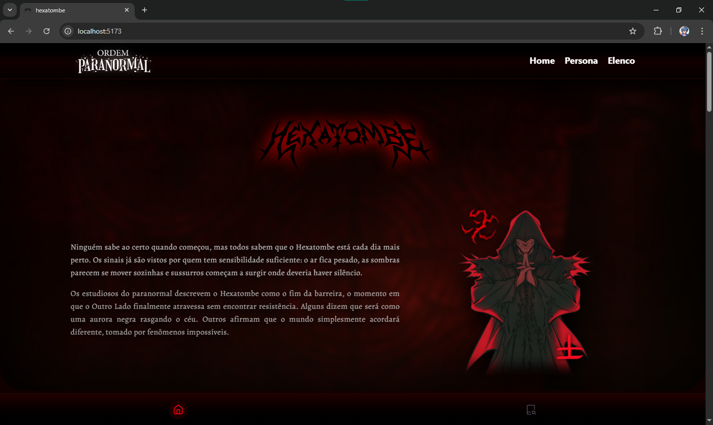
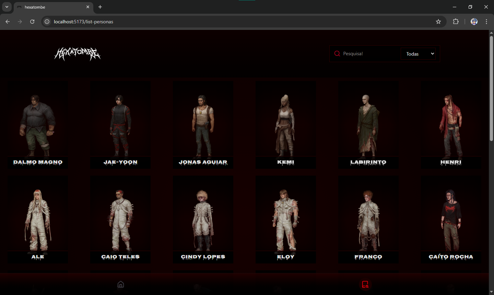

# 🩸 Hexatombe

> Projeto visual e narrativo focado em horror sobrenatural, mistério e tensão psicológica, apresentando o colapso entre o mundo real e o Outro Lado.

---

## 🌓 Visualização

|             Página Inicial             |     Página de Personagens     |
| :------------------------------------: | :---------------------------: |
|  |  |

---

## 🚀 Objetivo

O objetivo do Hexatombe é criar uma experiência digital totalmente imersiva, utilizando o desenvolvimento web para transmitir uma atmosfera cinematográfica de horror. O projeto foi construído para praticar o desenvolvimento de interfaces altamente estilizadas, manipulação de rotas dinâmicas e animações performáticas que respondem à navegação do usuário.

---

## ✨ Novidades

Nesta nova etapa, o projeto passou por algumas mudanças importantes. Migrei o projeto de **JavaScript para TypeScript** e desenvolvi um **back-end** para conectar o front-end a um banco de dados **PostgreSQL**.

O back-end foi desenvolvido utilizando **Node.js, Express e Prisma**. Com o Express, criei uma API própria para disponibilizar os dados ao front-end. O **Prisma** foi utilizado como ORM para realizar a comunicação entre a API e o banco de dados PostgreSQL.

Também realizei o **deploy completo do projeto**, disponibilizando o front-end, o back-end e o banco de dados em serviços online.

* **Front-End:** Vercel
* **Back-End:** Render
* **Banco de Dados:** Neon Console

Com essa etapa, o projeto deixou de funcionar apenas localmente e passou a contar com uma estrutura completa, envolvendo **front-end, back-end, API e banco de dados**, todos integrados e funcionando em ambiente de produção.

---


## 🛠️ Tecnologias e Conceitos

O projeto foi desenvolvido utilizando práticas modernas de desenvolvimento **front-end e back-end**, com foco em componentização, organização do código, responsividade e criação de uma experiência visual imersiva.

- **React**: Biblioteca principal utilizada para a construção da interface, componentização e gerenciamento do estado da aplicação.

- **React Router DOM**: Utilizado para o gerenciamento das rotas e para permitir uma navegação fluida entre a página inicial e as páginas de detalhes dos personagens.

- **TypeScript**: O projeto foi migrado de JavaScript para TypeScript, proporcionando maior controle de tipagem, segurança e organização do código.

- **Tailwind CSS**: Utilizado para a estilização da aplicação por meio de classes utilitárias, permitindo criar uma interface escura, opressiva, responsiva e visualmente imersiva.

- **Lucide Icons**: Biblioteca de ícones utilizada para adicionar elementos visuais limpos e minimalistas à interface.

- **IntersectionObserver API**: Utilizada para detectar quando os elementos entram na área visível da tela e, assim, executar as animações de _FadeIn_ somente quando necessário.

- **PostgreSQL**: Banco de dados utilizado para armazenar e organizar as informações dos personagens e demais dados da aplicação.

- **Node.js**: Ambiente utilizado para desenvolver o back-end e executar a aplicação do servidor, fazendo a comunicação entre a API e o banco de dados.

- **Express**: Framework utilizado para a criação da API responsável por disponibilizar os dados do banco de dados para o front-end.

- **Prisma**: ORM utilizado para facilitar a comunicação entre a aplicação e o banco de dados PostgreSQL, permitindo consultar e manipular os dados de forma organizada e tipada.

---

## 🏗️ Funcionalidades Principais

- 🔮 **Lista de Personagens**: Cards estilizados com múltiplas formas por personagem, transições suaves e efeitos visuais inspirados em menus de jogos AAA.
- 📖 **Página de Informações**: Exibição detalhada de história, classe, status, equipe e intérprete através de um layout cinematográfico.
- 🎭 **Elenco**: Associação visual entre o ator/intérprete e o personagem organizada em um grid responsivo.
- 🌫️ **Animações Atmosféricas**: Movimentos sutis e não intrusivos que reforçam a estética ritualística e o mistério do projeto.

---

## 🎨 Direção de Arte

A identidade visual do projeto se afasta do padrão convencional de sites corporativos para abraçar uma estética de entretenimento:

- Uso simbólico de tons de vermelho, sombras profundas e ruído visual.
- Interface limpa, porém opressiva, focando na tensão psicológica através do design.

---

## 🔄 Como Rodar o Projeto

Para executar este projeto localmente, siga os passos abaixo:

1. **Clone o repositório:**

   ```bash
   git clone https://github.com/Herdes-s/hexatombe
   ```

2. **Acesse a pasta do projeto:**

   ```bash
   cd hexatombe
   ```

3. **Instale as dependências:**

   ```bash
   npm install
   ```

4. **Inicie o servidor de desenvolvimento:**
   ```bash
   npm run dev
   ```

---

## 🧠 Desafios e Aprendizados

* **Desafio: Coordenar as animações de FadeIn:** Um dos desafios foi controlar as animações de *FadeIn* sem prejudicar o desempenho da página.

* **Solução:** Para resolver esse problema, utilizei a **IntersectionObserver API**, que permite detectar quando os elementos entram na área visível da tela e executar as animações somente nesse momento, tornando o processo mais eficiente e leve.

* **Migração do JavaScript para TypeScript:** Durante o desenvolvimento, migrei o projeto de JavaScript para TypeScript. Com isso, pude colocar em prática meus conhecimentos de tipagem, aprendendo como a utilização de tipos pode facilitar a organização do código, identificar possíveis erros e tornar o desenvolvimento mais seguro.

* **Conexão com o banco de dados:** Este foi meu primeiro projeto em que conectei um front-end desenvolvido em React a um banco de dados **PostgreSQL**, utilizando o **Prisma**. Com isso, aprendi a estruturar e organizar os dados, criar relacionamentos entre as informações e compreender melhor a hierarquia e as dependências de um banco de dados.

* **Back-end com Express:** Desenvolvi um back-end utilizando **Node.js e Express** para intermediar a comunicação entre o front-end em React e o banco de dados PostgreSQL. Durante esse processo, aprendi a utilizar o Express em conjunto com o Prisma e aprofundei meu conhecimento sobre a criação e integração de **APIs REST** com aplicações front-end.


---

## 🔗 Link de Acesso

Confira o projeto online: [**Visualizar Hexatombe**](https://hexatombe-omega.vercel.app/)

---

## 👤 Autor

Desenvolvido por **Ernand Soares**.
